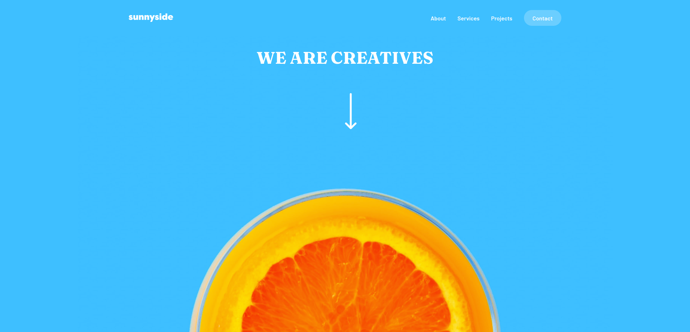
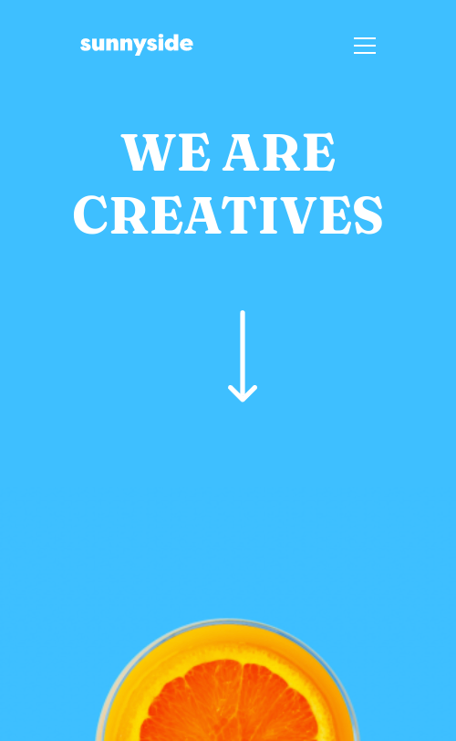
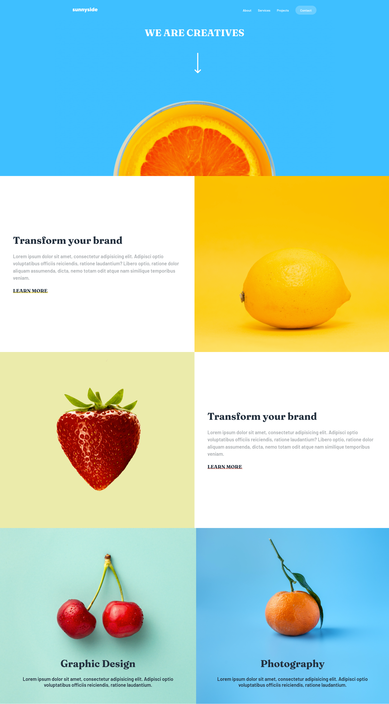

# Frontend Mentor - Sunnyside agency landing page solution

This is a solution to the [Sunnyside agency landing page challenge on Frontend Mentor](https://www.frontendmentor.io/challenges/sunnyside-agency-landing-page-7yVs3B6ef). Frontend Mentor challenges help you improve your coding skills by building realistic projects.

## Table of contents

- [Frontend Mentor - Sunnyside agency landing page solution](#frontend-mentor---sunnyside-agency-landing-page-solution)
  - [Table of contents](#table-of-contents)
  - [Overview](#overview)
    - [Screenshot](#screenshot)
    - [Screenshot Inteiro](#screenshot-inteiro)
    - [Links](#links)
  - [My process](#my-process)
    - [Built with](#built-with)
    - [Continued development](#continued-development)
    - [Useful resources](#useful-resources)
  - [Author](#author)

## Overview

### Screenshot

### Screenshot Inteiro

### Links

- Solution URL: [Add solution URL here](https://your-solution-url.com)
- Live Site URL: [Site](https://lucasf5.github.io/sunnyside-agency-landing-page/)

## My process

### Built with

- Semantic HTML5 markup
- CSS custom properties
- Flexbox
- SASS
- Mobile-first workflow

### Continued development

- During this project I developed my sass skills using it to help with css development.

### Useful resources

- [Unsplash](https://unsplash.com/s/photos/fruits) - Images taken from here.
- [SASS](https://sass-lang.com/) - Documentation I'm based on.

## Author

- Website - [Portfólio](https://lucasf5.github.io/Portifolio/)
- Frontend Mentor - [@lucasf5](https://www.frontendmentor.io/profile/lucasf5)
